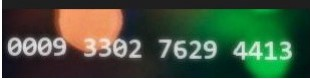
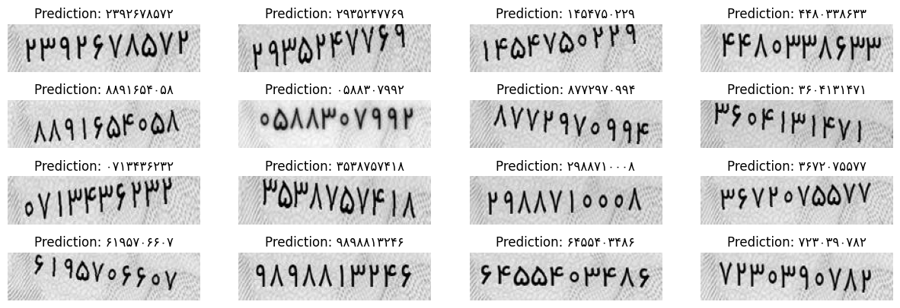

# CardNumber-DeepOCR

Deep Optical Character Recognition (OCR) for Iranian Credit Cards and National ID Cards using Keras.

## Table of Contents

## Dataset
For the main model, we did not generate data, but for one of the approaches we explored, which involved using the CTC loss, we decided to generate 10,000 data samples.
You can see the details of how this dataset was constructed in the [folder](CreateDataset) and see the model in the part of CTC loss in the [notbook](Final_Solution/CV_Project2_OCR.ipynb)

### Sample of the generated images

|National Card|Bank Card|
|-------------|---------|
|||

### Examples of model predictions

## Model

## How to run

## Results

