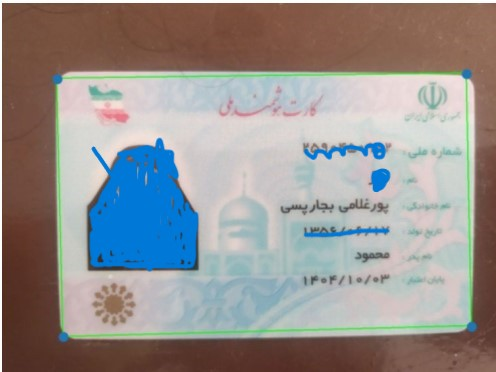
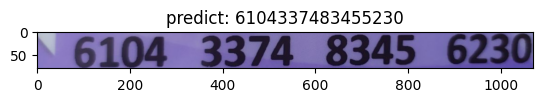
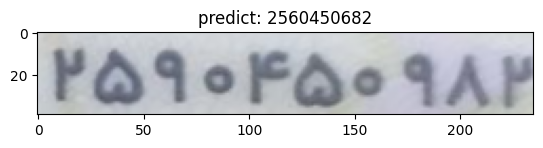

# CardNumber-DeepOCR

Deep Optical Character Recognition (OCR) for Iranian Credit Cards and National ID Cards using Keras.

## Table of Contents


## Dataset
For the main model, we did not generate data, but for one of the approaches we explored, which involved using the CTC loss, we decided to generate 10,000 data samples.
You can see the details of how this dataset was constructed in the [folder](CreateDataset) and see the model in the part of CTC loss in the [notbook](Final_Solution/CV_Project2_OCR.ipynb)

### Sample of the generated images

|National Card|Bank Card|
|-------------|---------|
|||

### Examples of model predictions


You can use this [model](Model_Save/nationalcardocr.h5)

## Model
### Cropping the relevant card section in the image.

1. Applying bilateralFilter and adaptiveThreshold

<!--  -->

2. Applying dilate and Canny

<!--  -->

3. Obtaining Contours

<!--  -->

4. Applying Perspective Transformation

<!--  -->

### Detecting the type of card (National ID or Bank card)

### Identifying the region corresponding to the numbers on the card

### Predicting the numbers and translating them into English


## How to run

For testing open ```CV_Project2_OCR.ipynb``` in Final_Solution folder inside Google Colab

### API's:

In the "CV_Project2_OCR.ipynb" notebook, a "predict" function has been implemented in the final section, which you can use
```bash
predict(pathTemplate,pathimage)
```
## Results

Credit cards            |  National cards
:-------------------------:|:-------------------------:
  |  


